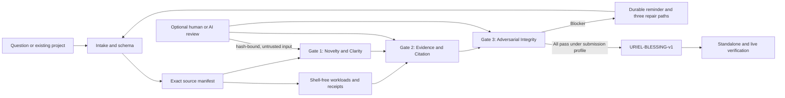

<p align="center">
  
</p>

# Uriel — The Evidence Lantern

<p align="center"><strong>Question assumptions. Trace evidence. Strengthen research.</strong></p>

<p align="center">
  <a href="https://github.com/dmonsta86/uriel/actions/workflows/ci.yml"></a>
  
  
  
  
</p>

Uriel is a free, offline-first research integrity harness for people who want to ask better questions, expose weak links in an argument, connect claims to inspectable evidence, and preserve a reproducible record of what was actually checked.

It can begin with a polished manuscript or with a rough question that is not yet expressed in academic language. Uriel preserves the original idea, asks only the clarifying questions that matter, and turns every unresolved problem into a durable repair path rather than a dismissal.

> [!IMPORTANT]
> Uriel does not certify truth, intelligence, prestige, or publication-worthiness. It certifies only that one exact recorded project state passed a named, inspectable policy and that the resulting package still matches its recorded hashes.

## Why the name?

Uriel is associated with light, wisdom, and illumination. The project borrows that symbolism for a simple purpose: to bring evidence, assumptions, contradictions, and uncertainty into view.

A successful audit is called **The Blessing of Uriel** because it must be earned by passing all three gates. It records what was examined, what evidence supported the result, and why the submitted version passed. It is not a claim of absolute truth.

## The doubt worth keeping

Think of a time you asked why something worked the way it did. You received an answer, but some small part of it did not fit what you had observed. You let the mismatch go because the explanation sounded settled: *it is what it is*.

That twinge of doubt is not proof that you are right. It may be a misunderstanding, missing context, or an intuition that fails as soon as it meets data. But it is still information: your model of the world and the explanation you were given do not yet fit together.

Uriel is built for that moment. It does not tell you to trust your first impression, and it does not tell you to discard it. It helps you state the question clearly, identify what would settle it, find the most direct evidence available, test competing explanations, and update your position faithfully.

A child, an outsider, or a tired researcher can ask a valuable question badly. Uriel judges the recorded argument—not the polish, credentials, age, status, confidence, or cost of the tools behind it.

## What Uriel does

The deterministic core uses only the Python standard library. Without an account, API key, paid model, GPU, or database server, it can:

- preserve a rough question before suggesting clearer formulations;
- confine all trusted state to one exact project root and refuse path, link, junction, and volume escapes;
- create atomic JSON state and a hash-chained provenance ledger;
- inventory project files in a content-addressed SHA-256 source manifest;
- execute explicit workloads without a shell and bind their output to before/after source receipts;
- register evidence as modular claim → artifact → locator → extraction → interpretation → limitation chains;
- distinguish direct or primary evidence from secondary interpretation;
- detect structural gaps, contradictory declarations, unsupported claims, framing risks, common fallacy patterns, stale receipts, omissions, and scope drift;
- run the Three Gates under exploratory, standard, strict, or submission profiles;
- preserve every blocker in `.uriel/REMINDERS.md`, with exactly three repair paths;
- issue and verify a portable `URIEL-BLESSING-v1` package only after the submission profile passes.

AI and human reviewers may add candidate findings, search terms, or source locators. They remain outside the trust core and cannot pass a Gate merely by asserting that something is correct.

## The Blessing of Uriel — earned, never granted

A Blessing is not praise and it is not a rubber stamp. It is a content-addressed attestation that **one exact declared project state** met every mandatory condition under a named Uriel policy version.

A Blessing can be issued only when all of the following are true:

1. the project schema is valid and the question, hypothesis, scope, definitions, and falsifier are explicit;
2. the exact source manifest verifies and no included file is missing, changed, unexpectedly added, or replaced through a link;
3. every major claim resolves to current, inspectable support with an exact artifact hash and locator;
4. required execution receipts are fresh, bound to the same source state, and successful;
5. all Three Gates pass under the `submission` profile;
6. no mandatory Gate waiver or open blocker reminder remains;
7. the generated package, certificate, audit, receipts, and verifier agree on the same hashes.

The package includes a printable SVG certificate, QR payload, exact source manifest, complete Three-Gate audit, bound receipts, limitations and availability drafts, and a standalone standard-library verifier.

### What a Blessing means

It means:

- the declared record passed the implemented submission policy;
- the certificate refers to a specific, immutable project state;
- the package can be checked for tampering without trusting Uriel's author or an online service;
- a reviewer can see exactly what was included, what was tested, and what limitations were declared.

### What a Blessing does not mean

It does **not** mean:

- the hypothesis is true;
- the work is globally novel or the literature search is complete;
- an instrument, dataset, quotation, or interpretation is unbiased or correct;
- no relevant data was withheld outside the declared project;
- ethics, law, privacy, consent, licensing, or safety requirements are satisfied;
- the work survived independent peer review;
- a journal, conference, funder, or regulator should accept it;
- the author's identity was cryptographically verified.

A Blessing is therefore a strong, reproducible evidence boundary—not omniscience.

## The Three Gates

Every audit evaluates all three Gates. A submission Blessing requires all three to pass with no unresolved blocker.

| Gate | The question it asks | What blocks a Blessing |
|---|---|---|
| **1. Novelty & Clarity** | Is the idea precise, neutral, testable, and honestly situated against prior work? | Vague terms, circular claims, loaded framing, no falsifier, or novelty claims beyond the recorded search. |
| **2. Evidence & Citation** | Can every important claim be traced to exact, current, inspectable support? | Missing artifacts or locators, stale hashes, inference presented as observation, omitted data, or conclusions inherited without inspecting their basis. |
| **3. Adversarial Integrity** | Has the preferred explanation survived a serious attempt to break it? | Control mismatches, hidden assumptions, unresolved contradictions, unexplained exclusions or missingness, absent alternatives, or conclusions that outrun the method. |

### Gate 1 — Novelty & Clarity

**Question:** Is there a precise, neutral, non-circular, falsifiable proposition worth testing?

A pass requires, where applicable:

- a bounded question and hypothesis;
- operational definitions and explicit comparators;
- a result that would count against the preferred explanation;
- neutral restatement and review of loaded framing;
- scope and non-claims that prevent silent generalization;
- a dated, reproducible prior-work search record;
- nearest prior work and concrete differentiators;
- honest limits on any novelty claim.

Common blockers include vague or elastic terms, circular definitions, authority or popularity used as proof, loaded framing, no falsifier, undefined populations or outcomes, and claims of universal novelty that the search record cannot support.

### Gate 2 — Evidence & Citation

**Question:** Does each important claim resolve to exact, current, directly inspectable support?

Uriel prefers the shortest reliable chain:

```text
claim
  → exact artifact or primary source
  → SHA-256 digest
  → precise locator
  → verbatim extraction or measured value
  → independent interpretation
  → alternative interpretations
  → limitation
```

Primary evidence is preferred whenever it is realistically reachable. Secondary papers remain useful for navigation, synthesis, vocabulary, and historical context, but another author's conclusion should not silently replace the underlying measurement, method, code output, archival record, or first-party source.

Common blockers include unsupported claims, citation-only evidence with no inspected artifact, stale or changed files, missing locators, inference presented as observation, causal language unsupported by design, selective reporting, omitted data, and contradictions that were recorded but never reconciled.

### Gate 3 — Adversarial Integrity

**Question:** Has the preferred explanation survived a fair attempt to break it?

A pass requires, where applicable:

- matched controls and justified comparison groups;
- declared exclusions, missingness, stopping rules, and negative results;
- competing explanations and counterevidence;
- explicit assumptions and tests that would expose their failure;
- contradiction records with evidence-based reconciliation;
- edge cases, race conditions, sensitivity checks, and failure modes;
- bounded conclusions that do not outrun the sample or method;
- ethics, privacy, licensing, safety, funding, and conflict disclosures;
- limitations written strongly enough that a skeptical reviewer can use them.

Common blockers include control mismatch, unexplained exclusions, absent negative findings, unresolved contradictions, missing-data silence, hidden assumptions, post-hoc scope expansion, unsupported waivers, and a limitations section that protects the conclusion instead of informing the reader.

## Audit profiles

| Profile | Intended use | Result |
|---|---|---|
| `exploratory` | A rough question or early idea | Converts missing structure into a research plan and durable reminders. |
| `standard` | An active research or software project | Expects a coherent claim, evidence map, and adversarial record. |
| `strict` | High-stakes internal review | Raises the evidentiary and contradiction-handling bar. |
| `submission` | A paper, release, or formal deliverable | Mandatory for a Blessing; no unresolved blocker is allowed. |

A failed Gate says only that the **current recorded state** has not earned a pass. It does not say that the question is foolish or that the project should be abandoned. Every blocker explains the gap, records the affected evidence, and offers exactly three ways forward.

## Sixty-second start

Install from the public repository:

```console
git clone https://github.com/dmonsta86/uriel.git
cd uriel
python -m pip install .
uriel --version
```

Start with a rough question:

```console
mkdir my-question
uriel intake "Could plants retain a measurable response to earlier weather?" --root my-question
cd my-question
uriel audit --profile exploratory
```

Uriel preserves the original wording and writes unresolved findings to:

```text
.uriel/REMINDERS.md
```

Register a directly inspectable artifact:

```console
uriel add-evidence artifacts/observation.csv \
  --id E1 --claim C1 \
  --description "Raw observation table from the declared protocol" \
  --source-locator "local:artifacts/observation.csv" \
  --data-location "rows 2-41, columns timestamp and response" \
  --extraction "The exact values used by analysis.py" \
  --interpretation "What those values support in the bounded sample" \
  --limitations "What this artifact cannot establish"
```

Run an analysis or test and preserve a receipt:

```console
uriel run --id analysis -- python analysis.py
uriel snapshot --index
uriel audit --profile submission
uriel blessing
```

Verify a copied Blessing package without installing Uriel:

```console
python verify.py PATH_TO_BLESSING
```

Verify it against the current local project and ledger:

```console
uriel verify-blessing PATH_TO_BLESSING --root PATH_TO_PROJECT
```

## One engine for new and existing work

### Beginning with an idle question

`uriel intake` preserves the exact wording, creates a project, runs an exploratory audit, and identifies the smallest clarifications needed to make the idea testable. The goal is not to force a child, outsider, or non-specialist to sound academic. The goal is to separate the valuable question from the missing structure around it.

### Auditing an existing paper or project

Place the manuscript, code, data extracts, protocols, and relevant artifacts beneath one project root. Register claims and evidence, execute reproducible checks through `uriel run`, build a source snapshot, and use the submission profile to expose unsupported mappings, omissions, contradictions, control problems, and scope drift before submission.

### Revisiting a refusal

Every blocker is durable. List, resolve, or reopen it later:

```console
uriel reminders list --root .
uriel reminders resolve REMINDER_ID --root . --note "Added the missing control and reran analysis."
uriel reminders reopen REMINDER_ID --root . --note "New evidence changed the interpretation."
```

## Try Uriel without installing anything

**Uriel Lens** is a copy-paste, read-only first pass for people who have a
question or project but do not want to install software yet.

Attach a paper, proposal, codebase, notes, or even a rough idea to an AI chat,
then paste the [compact Uriel Lens prompt](src/uriel/data/lens/URIEL_LENS_COMPACT.txt). It
will:

- recover the strongest version of what you are trying to do;
- show whether the project may be reaching toward a larger question;
- map claims to the evidence you actually supplied;
- check clarity, evidence, contradictions, omitted assumptions, controls, and
  adversarial weaknesses;
- fill the gaps it can fill honestly;
- give a minimum repair, best practical path, and next three actions.

No account or model is endorsed. Think about privacy before uploading sensitive
material. A local model or redacted copy may be the safer choice.

> **Boundary:** Uriel Lens is advisory. It cannot inspect material it was not
> given, bind artifacts to hashes, preserve a reproducible ledger, or issue
> **The Blessing of Uriel**. Use the full harness when provenance and formal
> verification matter.

Choose a starting point:

- [Copy-paste review](src/uriel/data/lens/URIEL_LENS_COMPACT.txt)
- [Full project review](src/uriel/data/lens/URIEL_LENS_FULL.md)
- [Turn a rough question into a project](src/uriel/data/lens/URIEL_SEED_PROMPT.txt)
- [Install as a portable agent skill](src/uriel/data/lens/uriel-lens-skill.md)
- [How Uriel Lens works](src/uriel/data/lens/COPY_THIS_ONE.txt)

Installed copies can print the same prompts directly:

```console
uriel lens --which compact
uriel lens --which full
uriel lens --which seed
uriel lens --which skill
```

## From a question to a submission

Uriel does more than point out weaknesses. It can help recover the strongest viable version of an idea, turn it into a research plan, organize evidence and data, prepare a manuscript packet, and guide revisions or submission one field at a time.

```text
Rough question
    ↓
Uriel Seed
    ↓
Research plan and evidence map
    ↓
Uriel Workbench + Data Desk
    ↓
Paper Builder
    ↓
Three-Gate audit
    ↓
Submission or revision packet
```

### No installation: Uriel Lens

Attach or paste a question, proposal, paper, or codebase into an AI chat and use the Uriel Lens prompt. It will identify the intended contribution, trace visible evidence, find gaps and contradictions, and propose the strongest honest path forward. Lens is advisory: it cannot inspect files it was not given, bind a review to artifact hashes, preserve an audit ledger, or issue The Blessing of Uriel.

### Guided submission and revision

Full Uriel can prepare a standalone packet containing the project summary, required actions, evidence map, manuscript checklist, response-to-reviewers draft, form entries, character counts, attachments, and one instruction file. Users can review the complete packet or ask Uriel to walk through the submission one field at a time.

A positive editorial decision does not end the workflow. Uriel records the decision, identifies every remaining obligation, prepares the response or production packet, and preserves the accepted or revised project generation.

### Designed for limited budgets

The deterministic core works offline. Optional AI use is provider-neutral and advisory. Uriel can create small, resumable context packets for free or rate-limited models and clearly warns users to consider privacy before uploading unpublished or sensitive work.

## Offline first; AI optional

The trusted core does not need AI. Uriel identifies tasks that genuinely require semantic judgment, literature search, or domain expertise and can export a bounded prompt for a human reviewer, a local model, OpenCode, ChatGPT Web, DeepSeek Web, or another service.

```console
uriel prompt primary-evidence --provider generic --show
uriel prompt adversarial-review --provider local --show
```

No provider is endorsed. Pricing, retention, training use, jurisdiction, security controls, and terms can change. Before sending non-public work to any external service, check the provider's current policy and your authorization to disclose the material.

For confidential or restricted projects, prefer the offline deterministic core, an authorized human reviewer, or a carefully inspected local model. “Free” describes price, not privacy.

Read [Privacy and optional AI](docs/PRIVACY_AND_AI.md), [Free/cheap AI quick start](docs/FREE_AI_QUICKSTART.md), and [Model selection](docs/MODEL_GUIDE.md).

## Architecture



The AI boundary remains outside the trust core. Imported reviews must match the current project and source hashes. Their existence cannot pass a Gate; every proposed locator and interpretation still has to be inspected and registered.

Read [Why Uriel?](docs/WHY_URIEL.md), the [Three Gates in detail](docs/THREE_GATES.md), the [architecture](docs/ARCHITECTURE.md), the [research lifecycle design](docs/LIFECYCLE.md), [Blessing specification](docs/BLESSING_SPEC.md), [threat model](docs/THREAT_MODEL.md), [philosophy](docs/PHILOSOPHY.md), and [known limitations](docs/LIMITATIONS.md).

## Portable use

Build a one-file standard-library-only application:

```console
python scripts/build_portable.py
python dist/uriel.pyz --version
```

Copy `dist/uriel.pyz` to another machine with a compatible Python installation:

```console
python uriel.pyz --help
```

See [Portable use](docs/PORTABLE.md).

## Compatibility and verification

Uriel is designed for Windows, macOS, and Linux and has zero runtime package dependencies. The repository's GitHub Actions matrix is the authoritative public compatibility record; local success on one machine is not represented as proof of another platform.

Development verification:

```console
python -m pip install --upgrade pip setuptools wheel
python -m pip install -e .
python -m unittest discover -s tests -v
python scripts/privacy_sweep.py
python scripts/release_check.py --full
```

The public compatibility record—not a README promise—is authoritative. The release remains a candidate until the advertised matrix is green and external users have exercised real projects that reveal false positives, false negatives, usability failures, and domain-specific gaps. See [Compatibility and support](docs/COMPATIBILITY.md).

## Repository map

```text
src/uriel/                 trusted Python package
src/uriel/core.py          confinement, atomic state, manifests, receipts, ledger
src/uriel/demo.py          bounded end-to-end passing fixture
src/uriel/audit.py         Three-Gate policy engine
src/uriel/blessing.py      package, certificate, QR payload, verification
src/uriel/prompts.py       privacy-aware optional review prompts
src/uriel/reviews.py       hash-bound review contract and import
scripts/Uriel.ps1          PowerShell 5.1+ wrapper
tests/                     cross-platform standard-library test suite
schemas/                   editor-facing JSON Schemas
docs/                      architecture, privacy, accessibility, and release guidance
.opencode/                 read-only optional Uriel review agent and commands
```

## Contributing

Start with [CONTRIBUTING.md](CONTRIBUTING.md) and [AGENTS.md](AGENTS.md). The most valuable contributions are:

- reproducible false-positive and false-negative fixtures;
- discipline-specific reporting and evidence adapters;
- accessibility and plain-language improvements;
- cross-platform failures with minimal reproductions;
- threat-model and verifier hardening;
- examples where a superficially strong argument fails one Gate for a non-obvious reason.

Uriel should become stricter only when the new rule is explainable, testable, and paired with a constructive repair path.

## License

MIT. See [LICENSE](LICENSE).
