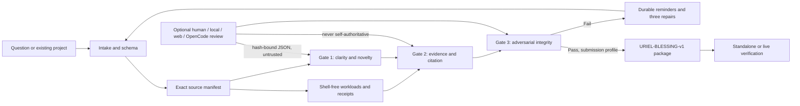

# Uriel
<p align="center">
  
</p>
<p align="center"><strong>Illuminating reproducible research, schema validation, and artifact provenance for AI engineering.</strong></p>

<p align="center">
  
  
  
  
</p>

Uriel is a **deterministic, offline-first research integrity harness**. It turns a question, manuscript, software claim, or research project into a traceable set of claims, source artifacts, execution receipts, adversarial checks, and durable repair reminders.

Uriel does not score prestige, credentials, age, confidence, or writing polish. A rough question is preserved before it is clarified. A refusal means only that the **current recorded state** has not earned a certificate.

> [!IMPORTANT]
> A Uriel Blessing is a content-addressed provenance and policy attestation. It is **not peer review, proof of truth, proof of global novelty, legal advice, ethics approval, or a guarantee of acceptance**.

## Why Uriel exists

Research failures often hide in the seams: a claim has no exact datum, a control changed between groups, a conclusion silently expands beyond the sample, a citation points to another author’s interpretation instead of the underlying measurement, a negative result disappeared, or an artifact changed after the analysis ran.

Uriel makes those seams explicit and machine-checkable where possible. It prefers **modular claim → direct artifact → exact locator → interpretation → limitation** chains. AI can help search or challenge a project, but AI output never becomes trusted merely because a model produced it.

## What works without AI

The trusted core uses only the Python standard library:

- exact project-root confinement with symlink, junction, traversal, and volume-escape refusal;
- atomic JSON writes and content-addressed SHA-256 manifests;
- exact source membership checks for missing, modified, duplicated, and unexpected files;
- shell-free workload execution with bound stdout/stderr and pre/post source receipts;
- SQLite artifact indexing;
- a hash-chained local provenance ledger;
- structural schema validation and deterministic Three-Gate audits;
- persistent `.uriel/REMINDERS.md` repair queues;
- content-addressed Blessing packages with an SVG certificate and dependency-free QR encoder;
- standalone package verification with stock Python.

## Install

### From this repository

Copy the HTTPS address from the repository's **Code** button, then:

```console
git clone https://github.com/dmonsta86/uriel.git
cd uriel
python -m pip install .
uriel --version
```

Maintainers preparing the first public copy should begin with [START_HERE.md](START_HERE.md). The detailed [GitHub publishing guide](docs/PUBLISH_TO_GITHUB.md) includes a GitHub Desktop route and browser-authenticated one-command scripts.

For development:

```console
python -m pip install -e .
python -m unittest discover -s tests -v
```

The distribution name is currently `uriel-research`; the command is always `uriel`. Until a package is actually published, this README does not pretend that a PyPI command is live.

### Portable, no installation

Build one standard-library-only executable archive:

```console
python scripts/build_portable.py
python dist/uriel.pyz --version
```

Copy `dist/uriel.pyz` to another machine with Python 3.9+ and run:

```console
python uriel.pyz --help
```

See [Portable use](docs/PORTABLE.md).

### Windows PowerShell wrapper

Dot-source `scripts/Uriel.ps1` to get `Invoke-Uriel` plus a small set of
strongly-typed helpers (`Initialize-UrielProject`, `Invoke-UrielAudit`,
`New-UrielSnapshot`, `New-UrielBlessing`, `Test-UrielProject`):

```powershell
. .\scripts\Uriel.ps1
Invoke-Uriel --version
Invoke-UrielAudit -Profile submission -Root my-study
```

The wrapper prefers `dist/uriel.pyz` when present and otherwise falls back to
`python -m uriel`, so it works with or without installation. Windows PowerShell
5.1 and PowerShell 7+ are both supported; if your execution policy blocks
unsigned scripts, run the dot-source line with
`powershell -NoProfile -ExecutionPolicy Bypass -Command ". .\scripts\Uriel.ps1; Invoke-Uriel --version"`.

## Sixty-second start

```console
mkdir my-question
uriel intake "Could plants retain a measurable response to earlier weather?" --root my-question
cd my-question
uriel audit --profile exploratory
```

Uriel preserves the original wording, creates a small set of high-value clarification questions, evaluates all Three Gates, and writes unresolved findings to:

```text
.uriel/REMINDERS.md
```

Add a directly inspectable artifact without manually calculating a digest:

```console
uriel add-evidence artifacts/observation.csv \
  --id E1 --claim C1 \
  --description "Raw observation table from the declared protocol" \
  --source-locator "local:artifacts/observation.csv" \
  --data-location "rows 2-41, columns timestamp and response" \
  --extraction "The exact values used by analysis.py" \
  --interpretation "What those values support in the bounded sample" \
  --limitations "What this artifact cannot establish"
```

Run analysis or tests with a receipt:

```console
uriel run --id analysis -- python analysis.py
uriel snapshot --index
uriel audit --profile submission
uriel blessing
```

A failed audit exits with status `2`, reports every Gate, gives exactly three repair paths per blocker, and preserves a reminder. A Blessing can be issued only after a fresh `submission` audit passes all mandatory Gates.

## The Three Gates

| Gate | Question | Deterministic examples |
|---|---|---|
| **1 — Novelty & Clarity** | Is the proposition bounded, neutral, non-circular, falsifiable, and searched against prior work? | Placeholder/vague terms, global novelty language, loaded framing, undefined comparators, common fallacy patterns, missing falsifier or scope. |
| **2 — Evidence & Citation** | Does every major claim resolve to exact, current, directly inspectable support? | Artifact path and digest, exact source/data locator, primary-vs-secondary status, extraction separated from interpretation, stale receipts, omitted-data attestations, unsupported causal claims. |
| **3 — Adversarial Integrity** | Were controls, missingness, alternatives, contradictions, edge cases, ethics, limitations, and reviewer objections addressed? | Control mismatch, exclusions, missing-data plan, untested assumptions, unresolved contradictions, absent negative results, submission-scope drift, unsupported waivers. |

Profiles are intentionally different:

- `exploratory`: turns an early idea into a repair-oriented research plan;
- `standard`: expects a coherent working project;
- `strict`: raises the evidentiary and adversarial bar;
- `submission`: mandatory for a Blessing and allows no unresolved blocker.

## Architecture



The AI boundary is deliberately outside the trust core. Uriel exports a bounded prompt, warns about privacy, records source/project hashes, preserves raw model output, and imports only a validated review contract. The deterministic engine still decides whether the declared record passes.

Read the [architecture](docs/ARCHITECTURE.md), [threat model](docs/THREAT_MODEL.md), and [known limitations](docs/LIMITATIONS.md).

## Free and low-cost AI help

AI is optional. Uriel can tell a user what requires literature search, semantic interpretation, or domain expertise and generate a prompt for a free web interface or OpenCode.

```console
uriel prompt primary-evidence --provider opencode --show
uriel prompt adversarial-review --provider chatgpt-web --show
```

The repository includes a privacy-conservative OpenCode agent and commands. Start with currently available free OpenCode models in short bursts, keep tasks narrow, and save the imported result. For the hardest final adversarial pass, the model guide recommends **GPT-5.6 Sol Pro** for the highest-capability single-model ChatGPT option, **GPT-5.6 Sol with `ultra` mode** where coordinated multi-agent work is available, **Extra High** as the highest standard Sol reasoning slider in ChatGPT, or **`max` reasoning** where the API/Codex surface exposes it—without making any model a requirement or source of truth.

See [Free/cheap AI quick start](docs/FREE_AI_QUICKSTART.md) and [model selection](docs/MODEL_GUIDE.md).

## Example optional OpenCode run

```console
opencode models
uriel assist adversarial-review \
  --model opencode/deepseek-v4-flash-free \
  --acknowledge-external
```

Model identifiers and free pools change. Copy the exact current identifier from `opencode models`; do not rely on the example forever. Sharing is disabled in the checked-in `opencode.json`, and the Uriel review agent cannot edit files or run shell commands.

## Blessing contents

A successful package includes:

```text
blessing.json                 content-addressed package manifest
certificate.svg               printable certificate with QR payload
certificate.txt               plain-text certificate
source-manifest.json          exact source inventory used by the audit
audit.json                    complete Three-Gate result
receipts/                     bound execution receipts
reviews/                      imported optional review contracts
submission/cover-letter.md
submission/limitations.md
submission/data-availability.md
submission/venue-notes.md
submission/formatting-checklist.md
verify.py                     standalone standard-library verifier
```

Verify anywhere:

```console
python verify.py PATH_TO_BLESSING
```

Verify against the live local ledger and source state:

```console
uriel verify-blessing PATH_TO_BLESSING --root PATH_TO_PROJECT
```

## Designed for accessibility

- No account, API key, GPU, database server, or paid model is required for core use.
- Plain JSON and Markdown remain editable with basic tools.
- Human-readable output has machine-readable `--json` equivalents.
- Early questions receive clarification, not dismissal.
- Findings target the recorded argument, never the author.
- External AI can be replaced by a local model, a human reviewer, a free web session, or no AI at all.
- The portable build is one file and keeps derived state inside the project.

## Repository map

```text
src/uriel/                 trusted Python package
src/uriel/core.py          confinement, atomic state, manifests, receipts, ledger
src/uriel/demo.py          bounded public end-to-end demonstration fixture
src/uriel/audit.py         Three-Gate policy engine
src/uriel/blessing.py      package, certificate, QR payload, verification
src/uriel/prompts.py       privacy-aware optional review prompts
src/uriel/reviews.py       hash-bound review contract/import
scripts/Uriel.ps1          PowerShell 5.1+ wrapper
tests/                     cross-platform standard-library test suite
schemas/                   editor-facing JSON Schemas
docs/                      architecture, accessibility, release and grant guides
.opencode/                 read-only Uriel review agent and slash commands
```

## Open-source maintenance and Codex for OSS

The repository contains an honest application worksheet for the OpenAI Codex for Open Source program. It does not fabricate users, adoption, maintenance history, or ecosystem importance. Publish the repository, make the maintainer profile public, add real release/issue activity, and replace the worksheet brackets only with verifiable facts.

See [Codex for OSS application guide](docs/CODEX_FOR_OSS_APPLICATION.md).

## Development status

`1.0.0` is an initial release candidate. The deterministic tests, wheel/source builds, portable archive, and a fresh wheel installation pass locally, but this is not yet evidence of broad field validation. Before claiming production readiness, run the CI matrix on public GitHub, invite domain-specific audits, publish a threat-model review, and collect real-world projects that expose false positives and false negatives.

## Contributing

Start with [CONTRIBUTING.md](CONTRIBUTING.md) and [AGENTS.md](AGENTS.md). The highest-value contributions are reproducible false-positive/false-negative fixtures, discipline-specific reporting adapters, accessibility improvements, and verifier hardening—not broader marketing claims.

## License

MIT. See [LICENSE](LICENSE).
