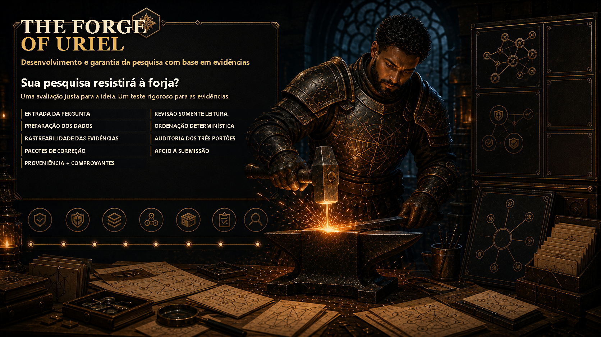

<p align="center">
  
</p>

<p align="center">
  <a href="https://github.com/dmonsta86/uriel/actions/workflows/ci.yml">
    
  </a>
  
  
  <a href="LICENSE">
    
  </a>
  
</p>

<p align="center">
  🌐 <strong>Languages:</strong>
  <a href="README.md">English</a> |
  <a href="README.es.md">Español</a> |
  <a href="README.fr.md">Français</a> |
  <a href="README.pt-BR.md">Português (Brasil)</a> |
  <a href="README.zh-Hans.md">简体中文</a> |
  <a href="README.ar.md">العربية</a> |
  <a href="README.hi.md">हिन्दी</a> |
  <a href="README.ja.md">日本語</a>
</p>

# The Forge of Uriel

> **Aviso**: Esta documentação recebeu uma segunda revisão assistida por IA (AI_SECOND_PASS_REVIEWED). O pôster é uma variante localizada revisada por IA (LOCALIZED_AI_REVIEWED), mas seu texto visível ainda requer revisão de um falante nativo (AI_ASSISTED_REQUIRES_NATIVE_REVIEW). Correções são bem-vindas.

<!-- URIEL:SECTION:mission:START -->
### Desenvolvimento e blindagem de pesquisa de código aberto e local

> **Sua IDEIA é forte o suficiente para sobreviver à forja?**
>
> Um exame justo para a ideia. Um teste rigoroso para a evidência.

O The Forge of Uriel ajuda a transformar perguntas preliminares e projetos existentes em trabalhos de pesquisa estruturados, reproduzíveis e prontos para submissão.

Ele verifica os dados antes da análise, rastreia afirmações importantes até a evidência direta, preserva contradições e limitações, expõe enquadramentos enganosos e conclusões não apoiadas, e converte verificações com falha em caminhos concretos de reparo e submissão.

Ele não foi projetado para fazer a pesquisa parecer mais forte. Ele foi projetado para mostrar exatamente o quão forte a pesquisa é—e o que a tornaria ainda mais forte.

```text
Interpret generously.
Test rigorously.
Report honestly.
```

---

<!-- URIEL:SECTION:status:START -->
## Limite de lançamento atual

O The Forge of Uriel **1.0.0-rc2** é uma versão candidata pública de um conjunto de ferramentas de desenvolvimento e blindagem de pesquisa de código aberto e local.

```text
uriel --version
# uriel 1.0.0rc2
```

---

<!-- URIEL:SECTION:difference:START -->
## O que o torna diferente

A maioria das ferramentas de pesquisa lida com apenas uma camada: pesquisa bibliográfica, redação, estatística, citações, reprodutibilidade ou revisão.

O The Forge of Uriel foi construído para conectar toda a cadeia.

### Dar à ideia seu exame mais justo

Uma articulação deficiente não é evidência de um pensamento fraco. O Uriel preserva a pergunta original, esclarece a versão testável mais sólida, registra interpretações concorrentes, identifica suposições ocultas e pergunta quais evidências refutariam a ideia.

### Verificar os dados antes de tirar conclusões

A Porta 0 impede que um resultado dependente de dados receba autoridade até que a geração exata do conjunto de dados tenha passado por verificações de identidade, ordenação, normalização, reconciliação e obsolescência.

Antes disso, a resposta honesta é:

> **O resultado ainda não é conhecido.**

### Tratar conclusões como afirmações, não autoridade herdada

Uma conclusão publicada, um autor prestigioso, um modelo confiante ou uma longa bibliografia não substituem a evidência.

O Uriel pergunta:

```text
What exactly is being claimed?
Which artifact supports it?
Where is the supporting datapoint?
What contradicts it?
What assumptions does it depend on?
What remains unknown?
What would change the result?
```

### Desafiar o trabalho concluído

As Três Portas testam a clareza, a evidência e a integridade adversarial. O Uriel procura por contra-evidências omitidas, denominadores ocultos, supergeneralização, saltos causais, erros de controle, vazamentos, suposições frágeis, fontes obsoletas e linguagem de resumo que excede o resultado subjacente.

### Reparar em vez de apenas criticar

Uma verificação com falha não deve terminar com uma rejeição vaga.

O Uriel registra o que continua útil, identifica o menor reparo honesto, seleciona o próximo passo mais sólido, prepara o que pode ser preparado com segurança e estabelece a condição exata para a reavaliação.

---

<!-- URIEL:SECTION:intellectual-honesty:START -->
## A pesquisa não deve ser ganha por enquadramento

Duas falhas enfraquecem repetidamente a pesquisa:

1. contra-evidências, resultados nulos, limitações ou pontos de dados embaraçosos desaparecem da história final; e
2. a conclusão torna-se mais ampla ou mais certa do que a evidência subjacente apoia.

O Uriel torna esses pontos duráveis. Ele registra o que foi testado, o que falhou, o que foi omitido e o que permanece incerto.

---

<!-- URIEL:SECTION:quick-start:START -->
## Início Rápido

A partir de uma cópia do repositório, instale sem dependências de execução nem
uma compilação isolada que exija rede:

```text
python -m pip install --no-deps --no-build-isolation .
uriel start --root ../my-study --kind new_idea --title "My study" --question "What would change my conclusion?"
uriel status --root ../my-study
uriel verify --root ../my-study
```

Pacote de distribuição: `uriel-research`. Importação Python e comando CLI:
`uriel`.

Para a opção de arquivo único sem instalação, consulte
[`docs/GETTING_STARTED_FREE.md`](docs/GETTING_STARTED_FREE.md).

---

<!-- URIEL:SECTION:data-readiness:START -->
## Prontidão de Dados (Porta 0)

Na ramificação canônica `main`, o fluxo local experimental `uriel data` pode planejar e selar CSV, TSV, JSON, JSONL, texto e Markdown em UTF-8; criar perfis estruturais e gerações imutáveis; visualizar diferenças; preservar cada registro durante a reconciliação; e reanalisar e verificar de forma independente o vínculo com os dados brutos. Ele não executa fórmulas, não presume unidades nem tipos semânticos, não cria achados científicos e não concede autoridade à Porta 0. A Porta 0 só começa depois que você declara explicitamente a identidade dos registros para uma geração exata.

Depois que `uriel data inspect` retornar o identificador da geração, crie e verifique o SortSpec vinculado a ela:

```text
uriel readiness init-sort-spec --root ../my-study --generation <GENERATION_ID> --keys id
uriel readiness check --root ../my-study --generation <GENERATION_ID>
uriel readiness status --root ../my-study --generation <GENERATION_ID>
```

O recibo v2 vincula a linhagem bruta, as versões do analisador e da política, os identificadores estáveis de colunas, a ordem, as regras de duplicatas e nulos, a reconciliação, o plano de análise e o SortSpec ativo exato. Estado ausente, obsoleto, adulterado ou ambíguo bloqueia a análise posterior. Se houver mais de um SortSpec, selecione explicitamente o caminho exato.

Pacotes de geração voltados à IA exigem um recibo PASS e linhas e colunas necessárias à tarefa. Eles são limitados a 1.000 linhas e 1 MiB, aceitam redação de valores e não têm autoridade sobre portas, publicação, achados ou Blessings. Cada pacote declara modo consultivo somente leitura: rede, shell e gravações no pacote ou projeto são negados, e a saída solicitada é limitada a 128 KiB e 15 minutos.

---

<!-- URIEL:SECTION:forge-forward:START -->
## Continuar uma execução incompleta do Forge

Os comandos experimentais do Forge operam em caminhos exatos endereçados por conteúdo, nunca em uma execução mutável "latest":

```text
uriel forge continue --root ../my-study --snapshot <EXACT_SNAPSHOT> --request artifacts/forge-forward.json
uriel forge verify-continuation --root ../my-study --packet <EXACT_CONTINUATION>
uriel forge export --root ../my-study --snapshot <EXACT_SNAPSHOT> --destination exports/review-copy
uriel forge verify-export --root ../my-study --manifest exports/review-copy/manifest.json --snapshot <EXACT_SNAPSHOT>
```

Os pacotes de continuação permanecem privados sob o estado ignorado `.uriel/forge/`. As exportações são diretórios novos contendo apenas metadados estruturais gerados e alias. Elas não copiam corpos de evidências, IDs de projeto/execução, caminhos privados, credenciais, URLs privadas ou nomes não relacionados. Cada verificador relê a fonte exata, recalcula hashes e classificações, rejeita arquivos ou links adicionais e relata zero autoridade de Gate, publicação, verificador, Benção ou Asas Ganhas.

Consulte o [Método Forge](docs/FORGE_METHOD.md) para a forma de solicitação fechada, regra de pontuação, derivação de bloqueadores e limites de recusa.

---

<!-- URIEL:SECTION:gates:START -->
## As Três Portas

### Porta 1 — Escopo e Linguagem de Afirmações

Avalia se as afirmações centrais estão delimitadas com precisão, se a terminologia é consistente e se os saltos causais ou supergeneralizados são eliminados.

### Porta 2 — Prontidão de Dados e Evidência Direta

Exige que cada afirmação material seja apoiada por evidências diretas e rastreáveis e gerações de dados verificadas.

### Porta 3 — Robustez Adversarial e Limitações

Expõe explicações concorrentes, vieses de enquadramento, contra-evidências omitidas e limites de aplicabilidade.

---

<!-- URIEL:SECTION:blessing:START -->
## A Bênção de Uriel

A Bênção de Uriel é um pacote experimental de atestação endereçado por
conteúdo. Ela vincula uma geração exata do projeto às decisões registradas das
portas, aos comprovantes, às limitações e à recomputação do verificador.

Ela significa que esses predicados registrados passaram para esses artefatos
exatos. Não é validação científica independente, assinatura criptográfica do
autor, revisão por pares nem prova de que as medições sejam verdadeiras.

---

<!-- URIEL:SECTION:ai:START -->
## Use o Uriel com ou sem IA

### Nota do mantenedor

O The Forge of Uriel foi desenvolvido com o uso extensivo do GPT-5.6 Sol no modo `ultra`, recomendado pelo mantenedor para suas análises de pesquisa de longo horizonte e testes adversariais mais profundos.

Este é um relato de experiência, não uma dependência, integração exclusiva, endosso de privacidade, garantia ou substituto para verificação determinística. Outros sistemas de IA capazes podem ser usados.

### Uma IA compatível

Uma IA compatível pode ajudar a esclarecer, organizar, rascunhar e criticar.

Ela não pode:

```text
mark Data Readiness PASS
pass an integrity gate
change publication authority
override a deterministic failure
issue a Blessing
```

---

<!-- URIEL:SECTION:privacy:START -->
## Segurança e Privacidade

O Uriel é projetado com base em:

```text
read-only defaults
exact-root confinement
explicit consent
verified managed copies
immutable generations
```

---

<!-- URIEL:SECTION:trials:START -->
## As Provas da Forja

A prova sintética incluída é um conjunto reproduzível com 24 problemas selados
no gabarito e uma rubrica de 100 pontos. A verificação de lançamento recalcula
o resumo limpo e valida o conjunto; ela não afirma que o Uriel detectou um
problema sem um relatório cego posteriormente adjudicado.

```text
python scripts/check_forge_trial.py
```

O método Forge descreve o fluxo público. Seu núcleo experimental local de
execuções, estados e verificação já está disponível:

```text
uriel forge init --root PROJECT --request INIT.json
uriel forge transition --root PROJECT --snapshot EXACT.json --to-state SCOPED --rationale "Scope reviewed"
uriel forge verify --root PROJECT --snapshot EXACT.json
```

Ele grava instantâneos privados e imutáveis e não concede autoridade superior.
O exportador saneado e a camada geral de prova de bloqueios/Próximo Movimento
permanecem planejados.

Consulte [`docs/FORGE_TRIALS.md`](docs/FORGE_TRIALS.md) e [`benchmarks/forge_trials/synthetic-001/`](benchmarks/forge_trials/synthetic-001/).

---

<!-- URIEL:SECTION:community:START -->
## Contribuições

Contribuições que melhorem a precisão, portabilidade, acessibilidade, segurança, documentação, traduções e fluxos de trabalho são bem-vindas.

Comece com:

- [`CONTRIBUTING.md`](CONTRIBUTING.md)
- [`SUPPORT.md`](SUPPORT.md)
- [`SECURITY.md`](SECURITY.md)

---

<!-- URIEL:SECTION:limitations:START -->
## Limitações conhecidas

O The Forge of Uriel foi construído para impor a honestidade intelectual e a linhagem de evidências, mas possui limites definidos:

- O Uriel não pode inventar dados ausentes nem fornecer medições de laboratório.
- O Data Desk relata observações estruturais e lexicais delimitadas; não é um mecanismo estatístico, um validador semântico nem substitui a inspeção das medições e dos métodos de origem.
- As lentes de IA são consultivas e não possuem autoridade sobre as decisões determinísticas das portas.
- Uma Porta ou Bênção experimental informa que os predicados registrados pelo Uriel passaram para artefatos exatos. Ela não estabelece validade de medição, verdade, aceitação editorial nem consenso.

---

## Citation and License

Os metadados de citação são fornecidos em [`CITATION.cff`](CITATION.cff). Licença MIT em [`LICENSE`](LICENSE).
